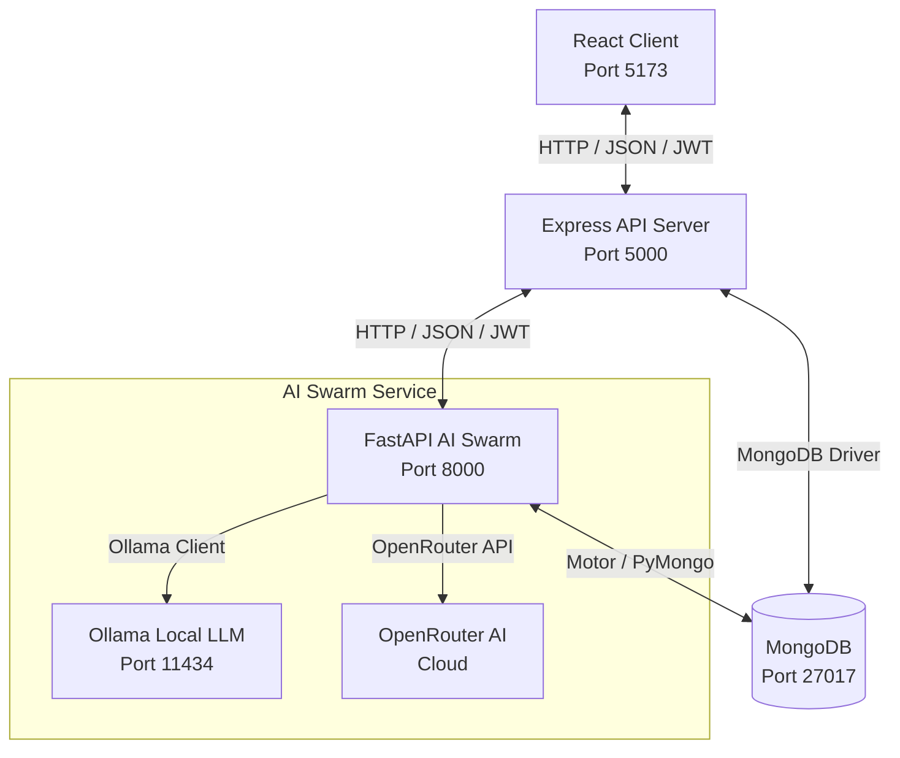

# 👥 Team Task Manager & AI Swarm

[](https://nodejs.org/)
[](https://www.npmjs.com/)
[](https://www.python.org/)
[](https://fastapi.tiangolo.com/)
[](https://expressjs.com/)
[](https://www.mongodb.com/)
[](LICENSE)

A production-ready, full-stack project and task management application integrated with a specialized multi-agent **AI Swarm** microservice. The platform features a responsive glassmorphic React frontend, a secure Express API server, and a LangGraph-orchestrated Python service for project health auditing, workload risk detection, and smart task recommendations.

---

## 🗺️ System Architecture

The application is built as a three-tier system communicating over secure cross-origin APIs:



---

## 📸 Visual Preview

### 🔐 Bento Promo & Onboarding
The split-screen authorization screen features a custom **Bento Promo Panel** mapping system network structures and AI service layers, complete with a platform-wide contact footer:


### 📊 Real-time Dashboard & AI Insights
Monitor project completion progress, health metrics, and run deep-dive task workload audits using the LangGraph swarm analyzer:


### 📁 Workspace & Project Auditing
Manage projects, allocate team access, and audit overall workspace status:


### 📋 Interactive Kanban Task Board
Assign, review, and filter tasks. Track team performance and instantly detect overdue items:


### 📄 Document Classification & Compliance Risk Mapping
Upload organizational contracts and memos to execute compliance audits and OPA policy-based verification:


---

## ✨ Features & Benefits

### 💻 Core Platform
* **Role-Based Access Control (RBAC)**: Secure access levels featuring `admin` and `member` roles. The initial registered user is promoted automatically to `admin`.
* **Kanban Task Board**: Intuitive drag-and-drop workflow status updating (`To Do` ➔ `In Progress` ➔ `Done`).
* **Real-time Analytics**: High-performance dashboard detailing project task metrics, completed percentages, workload statistics, and overdue tasks.
* **Document Audit System**: Secure contract management allowing admins to upload and classify documents (SEC filings, legal contracts, internal memos).

### 🧠 AI Swarm Engine
* **Multi-Agent Orchestration**: Powered by **LangGraph** to execute complex workflow graphs (Retrieve ➔ Analyze ➔ Synthesize ➔ Finalize).
* **Model Context Protocol (MCP)**: Utilizes custom MCP servers for data retrieval:
  * **Task Retriever Server**: Gathers real-time task statuses and user workloads directly.
  * **Project Auditor Server**: Audits project metrics, checks due dates, and detects overload risks.
  * **Report Synthesizer Server**: Compiles natural language project health summaries.
* **Flexible LLM Backends**: Integrates with local LLMs (via **Ollama**) or cloud LLMs (via **OpenRouter** like DeepSeek-R1 or Claude-3.5-Sonnet).

### 🔒 Policy-Based Security
* **OPA (Open Policy Agent)**: Security policies defined via Rego (`ai-swarm/security/policies.rego`) run at the agent level to guard tool execution, ensuring members can only request authorized tools (e.g. limiting contract analysis exclusively to admins).

### 🎨 Premium UI/UX Experience
* **Glassmorphic Theme**: Dark slate layouts (`bg-gradient-to-br from-slate-900 via-slate-800 to-slate-900`) combined with backdrop-blur sidebars and headers.
* **Bento Promo Panel**: Beautiful, responsive onboarding graphics detailing platform capabilities during Login/Signup.
* **Contrast-Optimized**: High-visibility glowing teal brand styling (`text-teal-400`) ensuring perfect accessibility.

---

## 📁 Repository Structure

```text
team-task-manager/
├── package.json          # Root scripts for concurrent development
├── docs/                 # Detailed system documentation and guides
│   ├── DEV_TRACKING.md   # Setup notes, troubleshooting, and dev history
│   ├── TESTING_REPORT.md # End-to-end integration and verification logs
│   └── AI_INTEGRATION_LEARNING_PATH.md # Complete multi-agent building path
│
├── client/               # React Frontend (Vite, Tailwind, Lucide React)
│   ├── src/
│   │   ├── components/   # Bento PromoPanel, Layout, and routing guards
│   │   ├── pages/        # Kanban board, Dashboard, Contracts, Auth
│   │   └── api/          # Axios configurations with JWT auth interceptors
│   └── package.json
│
├── server/               # Express API Server (Node.js, MongoDB, JWT)
│   ├── src/
│   │   ├── controllers/  # Auth, projects, contracts, and tasks endpoints
│   │   ├── models/       # Mongoose Schemas (User, Project, Task, Contract)
│   │   └── routes/       # Express routes including /api/ai proxy endpoints
│   └── package.json
│
└── ai-swarm/             # Python AI Swarm Microservice (FastAPI, LangGraph)
    ├── api/main.py       # FastAPI application and query router
    ├── orchestration/    # LangGraph agent definitions and state machines
    ├── mcp_servers/      # TaskRetriever, ProjectAuditor, ReportSynthesizer
    ├── security/         # OPA integration and policies.rego policies
    └── run.py            # Service runner and prerequisite validator
```

---

## 🚀 Getting Started

### 📋 Prerequisites

| Component | Requirement | Check Command |
|---|---|---|
| **Node.js** | `>= 18.0.0` | `node -v` |
| **npm** | `>= 9.0.0` | `npm -v` |
| **Python** | `>= 3.8.0` | `python --version` |
| **MongoDB** | `>= 6.0` | `mongod --version` |
| **Ollama** *(Optional)* | Local Service | `ollama --version` |

---

### 🔧 Installation & Setup

1. **Clone the Repository**
   ```bash
   git clone https://github.com/anan5093/team-task-manager.git
   cd team-task-manager
   ```

2. **Install Node.js Dependencies**
   ```bash
   # Install root tools (concurrently)
   npm install

   # Install Express Server dependencies
   npm install --prefix server

   # Install React Client dependencies
   npm install --prefix client
   ```

3. **Install AI Swarm Dependencies**
   Ensure you have a Python virtual environment activated:
   ```bash
   cd ai-swarm
   python -m venv .venv
   
   # Windows:
   .venv\Scripts\activate
   # Unix/macOS:
   source .venv/bin/activate
   
   pip install -r requirements.txt
   cd ..
   ```

---

### ⚙️ Environment Configuration

Create the following files in their respective folders:

#### 1. Express Backend Setup (`server/.env`)
```env
PORT=5000
NODE_ENV=development
MONGO_URI=mongodb://127.0.0.1:27017/team-task-manager
JWT_SECRET=generate-a-long-secure-random-key-here
JWT_EXPIRES_IN=7d
CLIENT_URL=http://localhost:5173
SWARM_API_URL=http://localhost:8000/api/swarm
SWARM_ENABLED=true
AI_SERVICE_SECRET=your-shared-agentic-secret
```

#### 2. React Client Setup (`client/.env`)
```env
VITE_API_URL=http://localhost:5000/api
```

#### 3. AI Swarm Service Setup (`ai-swarm/.env`)
```env
# LLM Provider Configuration
OLLAMA_BASE_URL=http://localhost:11434
MODEL=tinyllama

# For Cloud LLM override (Optional)
USE_OPENROUTER=false
OPENROUTER_API_KEY=your-openrouter-key-here
OPENROUTER_MODEL=deepseek/deepseek-r1:free

# Service Bindings
EXPRESS_API_URL=http://localhost:5000/api
FASTAPI_PORT=8000
MONGO_URI=mongodb://127.0.0.1:27017/team-task-manager
JWT_SECRET=generate-a-long-secure-random-key-here
AI_SERVICE_SECRET=your-shared-agentic-secret
```

---

### 🏃 Running the Application

For the application to run successfully, ensure MongoDB (and Ollama if running locally) is running in the background.

#### Step 1: Start Database & LLM Engine
```bash
# Start MongoDB (Default port: 27017)
mongod

# Start Ollama (Default port: 11434)
ollama serve
```

#### Step 2: Start the Web App Services
From the **root directory**, run:
```bash
npm run dev
```
This concurrently boots the **React Frontend** and the **Express Backend**.

#### Step 3: Start the Python AI Swarm Service
Open a **new terminal window**, activate your virtual environment, and run:
```bash
cd ai-swarm
python run.py
```
This runs validation checks and starts the FastAPI service.

#### Service Network Map

| Service | Port | Endpoint / URL |
|---|---|---|
| **React Client** | `5173` | [http://localhost:5173/](http://localhost:5173/) |
| **Express Server** | `5000` | [http://localhost:5000/health](http://localhost:5000/health) |
| **FastAPI Swarm** | `8000` | [http://localhost:8000/health](http://localhost:8000/health) |

---

## 🛠️ Usage Workflows

1. **User Registration**: Sign up via the login screen. The first account created will be given the `admin` role automatically.
2. **Setup Projects & Teams**: Admins can navigate to **Projects**, create a new workspace, and invite registered members.
3. **Task Allocation**: Create tasks inside the **Task Board**, assigning specific users, descriptions, and due dates.
4. **Kanban Operations**: Team members move tasks between `Todo`, `In-Progress`, and `Done` states. Overdue tasks are highlighted automatically in red.
5. **AI Dashboard Insights**: Navigate to a project dashboard and click **Get AI Insights** to execute the multi-agent swarm analysis. The service analyzes workloads, formats risks, and returns recommendations.
6. **AI Document Audit**: Upload a contract (Admin only) and click **Analyze Contract** to trigger the compliance risk evaluation.

---

## 📚 Documentation & Help

* **Detailed Development Logs**: Review [DEV_TRACKING.md](docs/DEV_TRACKING.md) for step-by-step setup guides, troubleshooting steps, and session logs.
* **AI Architecture Walkthrough**: Refer to [AI_INTEGRATION_LEARNING_PATH.md](docs/AI_INTEGRATION_LEARNING_PATH.md) for details on LangGraph configuration, MCP state models, and security structures.
* **Testing Reports**: See [TESTING_REPORT.md](docs/TESTING_REPORT.md) for end-to-end trace validation and performance analysis.

For bugs, inquiries, or support, please open an issue in the **GitHub Issues** tab or use the **Discussions** panel.

---

## 👥 Maintenance & Contributing

This project is currently maintained by [@anan5093](https://github.com/anan5093).

Contributions are highly encouraged! Please review our [Contribution Guidelines](CONTRIBUTING.md) to get started. For details on code style standards, linting, and development tracking, please read the [Developer Tracking Docs](docs/DEV_TRACKING.md).

---

## 📄 License

This project is licensed under the MIT License. See the [LICENSE](LICENSE) file for more information.
